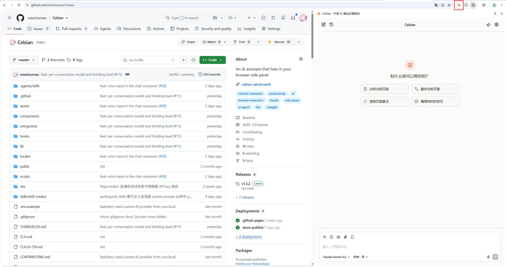

import Callout from '@/components/docs/Callout.astro';

Cebian is an AI Agent that lives in your browser sidebar. Once installed, click the Cebian icon in your browser to open it:

After configuring an AI provider, you can start chatting.

<Callout type="tip">
You don't need to set up MCP and Skills the first time you use it. Start by trying out some of the page-awareness features, then go deeper step by step.
</Callout>

## Core features

- **Local-first**: Conversations, Prompts, Skills, and attachments are all stored locally in your browser. Apart from the requests necessary to reach the model provider, no data is uploaded to any server.
- **Connect directly to your own models**: Just enter an API Key from any provider. No account, no credits, and no login required.
- **Extensible**: You can connect MCP tools*, and package common operations into Skills.

> Note: MCP only supports the HTTP protocol. See the [MCP section](/en/docs/guides/mcp/) for details.

## Capability examples

- Summarize the current web page, a long article, a document, or a PR.
- Select any content and have the model summarize, translate, or rewrite it.
- Extract tables, lists, or prices from a page and convert them to JSON or Markdown.
- Record a sequence of actions once and have the Agent replay it later on its own.
- Read PDF documents and answer related questions.
- ...

## What's next

If you haven't installed it yet, start with the [Installation guide](/en/docs/getting-started/installation/).
If you've already installed it, take a look at [Your first chat](/en/docs/getting-started/first-chat/).