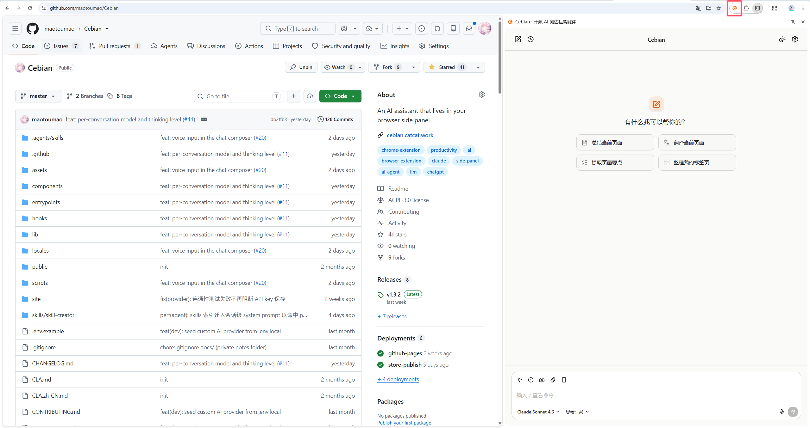

import Callout from '@/components/docs/Callout.astro';

Cebian is an AI Agent that lives in your browser sidebar. Once installed, click the Cebian icon in your browser to open it:

After configuring an AI provider, you can start chatting.

<Callout type="tip">
You don't need to set up MCP and Skills the first time you use it. Start by trying out some of the page-awareness features, then go deeper step by step.
</Callout>

## Core features

- **Local-first**: Conversation history, Prompts, Skills, memories, and workspace files are stored in the browser extension's data area. Local storage does not mean all processing happens locally.
- **Connect your own model service**: Configure a supported provider or a compatible API endpoint; some providers also support sign-in authorization. Cebian itself does not require an account. Model-service accounts, quotas, and charges depend on the provider.
- **Extensible**: Connect MCP tools or package common operations into Skills. MCP supports Streamable HTTP and SSE over HTTP(S), not directly launching local stdio servers. See the [MCP section](/en/docs/guides/mcp/).

## Where data goes

| Feature | Data flow |
| --- | --- |
| Chat and model-assisted features | Relevant context is sent to the model service in use, including messages, attachments, and any webpage, file, or tool results added to that context |
| Web search, page actions, MCP, and Skills | Depending on configuration and actual calls, these access search engines, websites, MCP servers, or external services used by scripts; relevant results may then be sent to the model |
| Voice input | Recognition prefers on-device processing; when that is unavailable, it falls back to the browser's speech service and audio may leave the device |
| WebDAV backup | When you create a remote backup, the selected data is uploaded to your configured WebDAV server |
| HTML preview | The Chromium sandbox can run scripts and access permitted external resources; static preview is not guaranteed to be offline either |

Local-first does not mean offline or that data never leaves your device. Check sensitive content before sending, and connect only to model and tool services you trust. Browser profiles have separate local data; uninstalling the extension or clearing its data may remove your records. [Back up](/en/docs/guides/backup/) important content first.

## Capability examples

- Summarize the current web page, a long article, a document, or a PR.
- Select any content and have the model summarize, translate, or rewrite it.
- Extract tables, lists, or prices from a page and convert them to JSON or Markdown.
- Record a sequence of actions once and have the Agent replay it later on its own.
- Read PDF documents and answer related questions.
- ...

## What's next

If you haven't installed it yet, start with the [Installation guide](/en/docs/getting-started/installation/).
If you've already installed it, take a look at [Your first chat](/en/docs/getting-started/first-chat/).