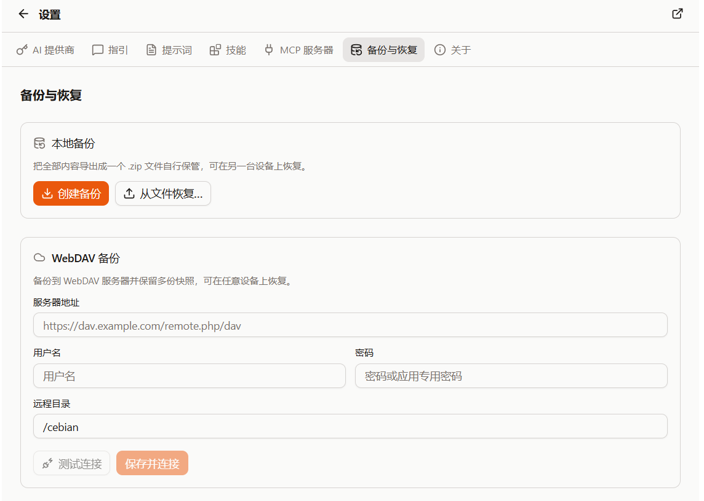

import { Image } from 'astro:assets';
import BackupDialogShot from '@/assets/docs/backup-dialog.png';
import BackupCategoriesShot from '@/assets/docs/backup-categories.png';

import QA from '@/components/docs/QA.astro';
import QAItem from '@/components/docs/QAItem.astro';

Cebian's data is mostly stored locally in the browser. When switching devices, reinstalling the browser, or wanting an insurance copy before tinkering with your configuration, make a backup first.

The backup entry point is under "Settings → Data". There are two methods here: download locally, or upload to WebDAV.

## Local backup

A local backup exports your data into a `.zip` file that you keep yourself.

The steps are:

1. Open "Settings → Data"
2. Click "Create backup" under "Local backup"
3. Choose a backup mode, and enable "Encrypt backup" if needed
4. After confirming, the browser downloads a `.zip` file

If you just want a temporary insurance copy, just create a full backup.

<Image src={BackupDialogShot} alt="Full backup dialog and encryption option" loading="lazy" />

## WebDAV backup

If you want to restore the same backup across multiple devices, you can configure WebDAV.

The first time, you need to fill in:

- Server address
- Username
- Password or app-specific password
- Remote directory

Once filled in, you can click "Test connection" first. After the connection works, save it, and then you can click "Back up to WebDAV" to upload a snapshot.

The WebDAV page lists the snapshots already on the server. Each snapshot can be restored or deleted.

## Backup modes

There are two modes when creating a backup:

- Full backup: includes conversations and workspace files, general settings, Skills & Prompts, memory, and secrets
- Partial backup: choose what to back up yourself

In a partial backup, you can select:

- Conversation history
- Include workspace files
- General settings
- Skills & Prompts
- Memory
- Secrets

For everyday use, a full backup is recommended; if you only want to migrate Prompts or Skills, use a partial backup.

<Image src={BackupCategoriesShot} alt="Partial backup categories, including Memory" loading="lazy" />

## Encrypted backup

If the backup includes "Secrets", enabling encryption is strongly recommended.

Secrets include API Keys, OAuth tokens, WebDAV passwords, and so on. Without encryption, this content is stored together with the backup file, which isn't suitable for sharing with others.

After enabling encryption, you need to enter a passphrase. You must enter the same passphrase when restoring. The backup name, description, time, and category summary remain unencrypted; do not put sensitive information in those fields.

Excluding "Secrets" only omits dedicated credential fields. It does not scan and remove secrets manually written into conversations, memories, files, or custom configuration text. Review the contents before sharing.

> The passphrase is not saved by Cebian. Remember it well; if you forget the passphrase, you won't be able to restore the backup.

## Restore from a backup

Both local backups and WebDAV snapshots go through the same restore flow.

Before restoring, Cebian first shows what the backup contains. You can select the categories to restore, then choose the restore method:

- Merge: keep extra local entries, then fill gaps or update according to the category. The backup does not always win.
- Replace: clear and restore conversation and file categories. Settings and secrets overwrite items present in the backup, rather than clearing every stored setting.

| Category | Merge | Replace |
| --- | --- | --- |
| Conversations | Add missing conversation IDs; overwrite a matching ID only if the backup has a later update time. Ties keep the local copy | Clear all local conversations, then import the backup |
| Workspace, Skills & Prompts, and memory files | Add missing paths; overwrite a matching path only if the backup has a later modification time. Ties or missing backup timestamps keep the local file; local directories are not overwritten | Clear the contents of the restored category's directories, then write the backup files |
| General settings | Fill ordinary settings only if never saved locally. Add missing custom Provider and MCP server IDs; page actions and search engines also keep local same-ID configurations and existing ordering | Overwrite settings present in the backup; keep local settings absent from it |
| Secrets | Add missing Provider credentials; keep existing WebDAV configuration. Fill empty MCP tokens and only replace an empty local group of custom headers | Overwrite credential items present in the backup; apply MCP tokens and custom headers only to existing configurations with the same ID |

Workspaces are not a separate restore option: they are restored with conversations when included in the backup. Each file is compared by its own modification time, even if its conversation was skipped.

When migrating custom Providers or MCP servers, normally restore both "General settings" and "Secrets". Replacing only general settings clears MCP tokens / custom headers in the configurations it overwrites; restore the secrets too or enter them again.

When unsure, start with "Merge", but it can still overwrite older same-ID conversations or same-path files. Back up your current data first, and avoid chatting or editing files during a restore.

## Backup contents

The content of each category is roughly as follows:

| Category | Content |
| --- | --- |
| Conversation history | Past conversations, messages, conversation titles, etc. |
| Workspace files | Files under `/workspaces/{sessionId}/` for backed-up conversations; excludes orphaned workspaces from deleted conversations |
| General settings | Theme, chat appearance, model selection, custom instructions, non-secret custom Provider and MCP configuration, memory and organizing settings, page actions, and search engine configuration |
| Skills & Prompts | Files in `~/.cebian/skills/` and `~/.cebian/prompts/` |
| Memory | Long-term memory files in `~/.cebian/memories/`; the feature switches and organizing settings belong to "General settings" |
| Secrets | Provider API Keys, OAuth tokens, MCP tokens, all custom MCP / custom Provider headers, and WebDAV connection configuration and credentials |

The backup does not include browser cookies or website login states. So after restoring to a new device, some model subscriptions or website logins may still need to be re-authorized.

## Q&A

<QA>
<QAItem q="I want to migrate to a new device. How should I back up?">Create a full backup, ideally with encryption enabled, then restore from the file or WebDAV on the new device.</QAItem>
<QAItem q="What if I only want to keep Prompts / Skills?">Create a partial backup and check only "Skills & Prompts".</QAItem>
<QAItem q="I'm worried about overwriting local data when restoring. What now?">"Merge" keeps extra local entries, but can overwrite older conversations or files. Back up your current data first.</QAItem>
<QAItem q="Does Replace clear all data?">No. It clears and rebuilds the selected conversation or file categories; settings and credentials only overwrite items present in the backup. It is not a full mirror restore of the extension. Back up your current data first.</QAItem>
<QAItem q="WebDAV won't connect. What now?">First check the server address, username, password, and remote directory. Some services require an app-specific password.</QAItem>
</QA>