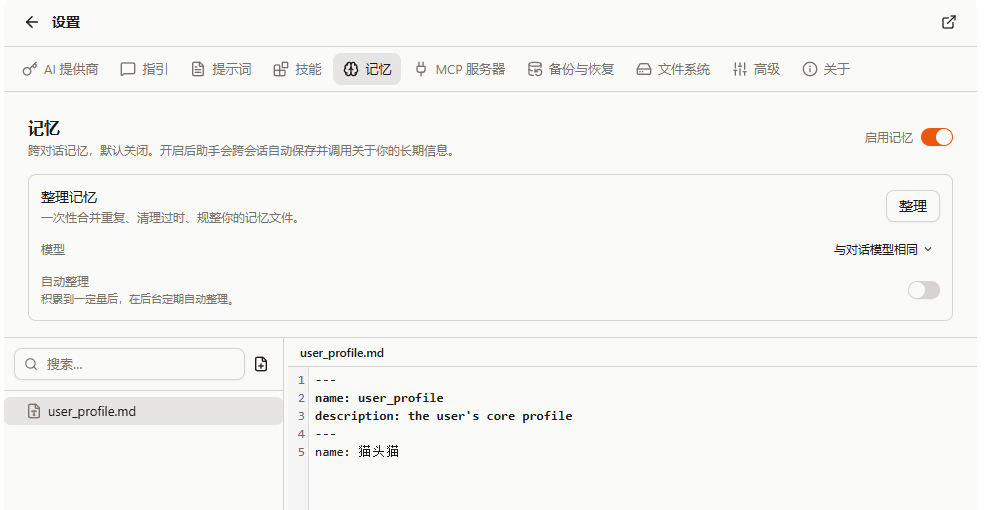

import QA from '@/components/docs/QA.astro';
import QAItem from '@/components/docs/QAItem.astro';

By default every new conversation in Cebian starts from scratch — it doesn't remember what you said last time. Memory lets the AI save the "about you, useful later" bits as local files during a chat, and automatically brings the relevant ones into your next conversation.

This feature is off by default; you turn it on yourself in settings.

## Enabling memory

The entry point is "Settings → Memory". Only after you turn on the "Enable memory" switch at the top will the AI read and write memories; while it's off, it writes nothing and brings no existing memory into conversations.

## How memory is stored

Each memory is a Markdown file under `~/.cebian/memories/` (in the VFS, not a real folder on your computer). The AI uses the ordinary file tools to write them, which is why you can see its "Remembering…" actions during a chat.

When a new conversation starts, Cebian puts a compact memory index into the context — just the title, type, description, and last-updated time of each entry — and the AI reads the matching file when it needs details. That way it knows what memories you have without stuffing every full body into the context each time.

One file is special: `user_profile.md` holds your core profile (name, role, language, accessibility needs, etc.). It is injected in full every turn, so these most basic facts are always present.

## What gets saved, what doesn't

What it saves is "cross-conversation, useful later" information, such as:

- Who you are, what you do, what language you prefer
- Long-term preferences (e.g. "lead with the conclusion", "no redundant comments in code")
- Where your things live (e.g. your tasks all sit in a certain Notion)

What it won't save (and is explicitly told not to):

- Sensitive content like passwords, tokens, cookies, payment and form data
- One-off task state and the temporary context of the current conversation
- Web page content it can read directly from the page or re-fetch anytime

Even if you say "remember this" outright, the AI first judges which part is actually worth keeping long-term.

## Memory types

Each memory has a type to keep things organized:

- user: core facts about you (consolidated into `user_profile.md`)
- feedback: a correction or confirmation about something the AI did
- context: background on something you're working on
- reference: where your frequently used resources or external info live

## Viewing and managing

"Settings → Memory" shows all memory files, and you can view, edit, and delete them directly — this is also the safety net for sensitive information: anything written down is something you can see and remove. Once deleted, new conversations no longer include it.

## Organizing memory

As memories pile up they get duplicated, stale, and scattered. Organizing has a temporary background AI read through them all and merge duplicates, drop stale notes, and tidy the bodies.

- Manual: click "Organize" on the memory page to run it right away.
- Automatic: with "Auto organize" on, Cebian organizes periodically in the background — only when it's been long enough since the last run (14 days by default), enough memories have been added or changed (30 by default), and no conversation is currently active.

The model used for organizing can be set separately; it defaults to the model your current conversation uses.

Organizing happens in a copy. It replaces your memories only after confirming they weren't touched in the meantime; if something goes wrong midway, or you happen to be writing a memory, this run is discarded and your existing memories are unaffected.

## Backup

Memory can be included in a backup on its own. When creating a backup under "Settings → Backup and restore", just tick "Memory"; you can also choose whether to restore memory separately. If you want to keep your memories after switching devices, remember to include it in a full or partial backup.

## Privacy

- Off by default: with it off, there's no memory reading or writing at all.
- Fully visible and deletable: every memory is viewable, editable, and deletable in settings.
- No sensitive info: the prompt explicitly tells the AI not to write things like passwords or tokens into memory.
- Injection-resistant: memory only holds "facts the AI summarized about you", never instructions from web pages; it's also injected below the core safety rules, which always take precedence over memory.

## Q&A

<QA>
	<QAItem q="Will the AI remember everything right after I enable it?">No. It only saves a piece of information when it judges it "cross-conversation, useful later", and stays conservative.</QAItem>
	<QAItem q="Where is memory stored? Is it uploaded?">In the browser's local VFS (`~/.cebian/memories/`). It isn't uploaded unless you back it up yourself.</QAItem>
	<QAItem q="How do I delete a memory?">Find the file under "Settings → Memory" and delete it; new conversations won't include it anymore.</QAItem>
	<QAItem q="Will auto-organize wrongly delete my memories?">Organizing happens in a copy and replaces the originals only after confirming they weren't changed; on any conflict the run is discarded. If you're worried, you can stick to manual organizing.</QAItem>
	<QAItem q="How do I keep memories when switching devices?">Tick "Memory" in the backup, and choose to restore memory on the new device.</QAItem>
</QA>
