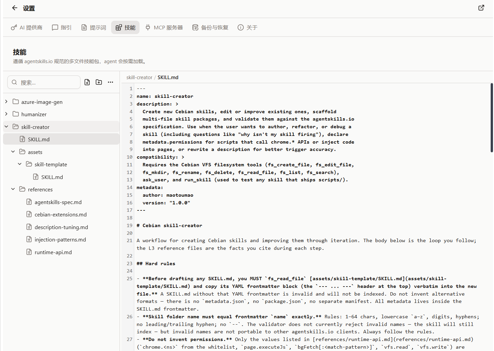

import Placeholder from '@/components/Placeholder.astro';
import QA from '@/components/docs/QA.astro';
import QAItem from '@/components/docs/QAItem.astro';

A Skill is an operation manual for the Agent. It can bundle the background knowledge, fixed steps, caveats, and scripts for a class of task together, so the model can read it on its own when needed.

If a Slash Prompt is more like "a reusable piece of input", a Skill is more like "a reusable workflow".



## When to use it

When something needs to be done repeatedly and follows a fixed set of rules each time, it's a good candidate for a Skill.

For example:

- A research report in a fixed format
- A price-comparison flow for a particular website
- The operating procedures for an internal company system
- A set of scripts and reference materials meant to be used together

If you just want to quickly insert a piece of prompt text, a Slash Prompt is enough; if you need multiple files, scripts, or detailed instructions, consider a Skill.

## The Skill Creator skill

If you've never written a Skill before, start with the official Skill Creator skill.

It's a Skill itself, and its job is to help you turn an idea into a Skill draft that conforms to Cebian's structure. You can describe what you want to do directly in a conversation, such as "help me make a Skill for researching competitor prices", and it will generate the directory, `SKILL.md`, and the necessary instructions for you.

For everyday use, you can have it generate a working version first, then go back to the skill editor to refine the details.

It's published together with Cebian's GitHub Release, with the file name `skill-creator.zip`:

[Cebian GitHub Releases](https://github.com/maotoumao/Cebian/releases)

How to install it:

1. Download `skill-creator.zip`
2. Open "Settings → Skills"
3. Click "Import..."
4. Select the zip you just downloaded

After importing, you can ask Cebian in a conversation to help you create or modify Skills.

## Create a Skill

The entry point is under "Settings → Skills".

After clicking "Create skill", Cebian automatically generates a `new-skill` folder (adding a number if that name exists) containing:

- `SKILL.md`: the skill entry file, where you write the description and trigger conditions
- `scripts/`: optional, for scripts
- `references/`: optional, for reference materials

A minimal `SKILL.md` looks roughly like this:

```md
---
name: price-compare
description: Compare prices across multiple product pages and organize them into a table.
---

## Instructions

When the user asks to compare prices, first read the current page, then organize the product name, price, link, and notes.
```

Edits are saved automatically; Ctrl/Cmd+S saves immediately. Give the folder and `name` a meaningful name using 1–64 lowercase letters, digits or hyphens, without leading, trailing or consecutive hyphens. Imports cannot use the reserved `builtin-` prefix.

The `description` is important. The Agent first looks at the skill index to decide whether the current request is suitable for reading this Skill.

## Trigger mechanism

You don't need to manually click a Skill in a conversation.

The Agent judges relevance from the name and description; its instructions require reading `SKILL.md` first when a Skill matches. This is not a fixed keyword trigger. You can also name the Skill directly in your request.

`metadata.matched-url` tells the Agent to use a Skill only on matching pages; it is neither an automatic trigger nor a permission restriction. Setting `metadata.disabled: true` hides the Skill from the index without deleting its files.

If the Skill mentions that it also needs to read `references/` or run `scripts/`, the Agent will use those files on demand as well.

## Import and export

The skills page supports importing and exporting.

- "Import": select a `.zip` skill package and, after confirming, write it into the VFS
- "Export": export the currently selected Skill
- "Export all": package all Skills into a single backup zip

If a Skill with the same name already exists during import, you can choose to overwrite it or keep both copies.

> Overwriting a Skill clears its previous "always allow" grant. Running a script that declares extra permissions then requires confirmation again.

## Permissions and scripts

Skill scripts are JavaScript run in a sandbox through `run_skill`, not local Shell or Python scripts. They read parameters through `args` and return results through `module.exports`; extra capabilities are declared in `SKILL.md` under `metadata.permissions`.

Reading Skill files and running scripts require a model with tool calling enabled. Before running a script with declared permissions that have not been granted, Cebian shows an authorization card in the conversation. You can choose:

- Deny
- Allow once
- Always allow this skill

Scripts with no declared extra permissions do not show this authorization card, but can still use basic JavaScript APIs such as `fetch`. Declaring new permissions requires authorization again.

A regular Skill can contain only instructions and reference materials, without any scripts. When starting out, it's recommended to begin with instruction-only Skills.

## File location

Skills are stored in the VFS under `~/.cebian/skills/`.

You generally don't need to open this path manually; just manage them under "Settings → Skills". When backing up, choose "Skills & Prompts" and the Skill files will be backed up too.

## Q&A

<QA>
<QAItem q="My Skill isn't being triggered. What now?">Check whether <code>name</code> and <code>description</code> clearly state when it applies. The Agent relies mainly on them to decide whether to read this Skill.</QAItem>
<QAItem q="My Skill is too long. What now?">Put stable rules in <code>SKILL.md</code>, and move large blocks of reference material into <code>references/</code>.</QAItem>
<QAItem q="I'm not sure whether to write a script. What now?">Don't write one yet. Add <code>scripts/</code> only when you actually need automatic execution.</QAItem>
<QAItem q="What should I watch out for when importing someone else's Skill?">Look at <code>SKILL.md</code> and <code>scripts/</code> first, and only use it if the source is trustworthy.</QAItem>
</QA>