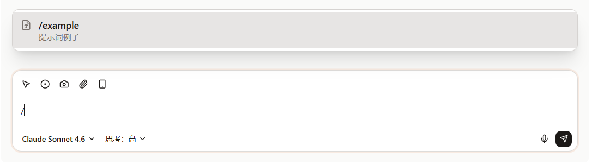

import Placeholder from '@/components/Placeholder.astro';
import QA from '@/components/docs/QA.astro';
import QAItem from '@/components/docs/QAItem.astro';

A Slash Prompt is a set of prompt templates you write yourself. While typing a message, just type `/` first and you can pick a template from the list to fill into the input box.

It's great for saving requests you write repeatedly, such as summarizing a web page, translating selected content, organizing meeting notes, or rewriting copy.



## Create a Prompt

The entry point is under "Settings → Prompts".


Click "New file" on the left to create a Markdown file. A Prompt file looks roughly like this:

```md
---
name: summarize-page
description: Summarize the current page
---

Please read the current page content and summarize it in concise bullet points.
```

Where:

- `name` is the name shown in the slash menu
- `description` is a one-line note to help you tell them apart later
- the body below the frontmatter is the content that ultimately gets filled into the input box

For everyday use, a few short templates are enough to start. Once you get comfortable, gradually organize them into your own prompt library.

> Note: the file name has no special meaning; the name shown in the slash menu is the `name` field in the frontmatter. You can change `name` at any time to adjust how it appears in the menu, without renaming the file.

## Use it in a chat

Back in the chat input box, type `/` to open the Prompt list.

You can keep typing keywords to filter, then press Enter on a selection, or just click an item. Cebian fills the Prompt content into the input box.

It won't send automatically after filling. You can edit it first, then send manually.

## Template variables

You can write certain variables in a Prompt, and when triggered Cebian replaces them with the real content from the current environment.

| Variable | Meaning |
| --- | --- |
| `{{selected_text}}` | The text selected on the current page |
| `{{page_url}}` | The current page URL |
| `{{page_title}}` | The current page title |
| `{{date}}` | The current date |
| `{{clipboard}}` | Clipboard content |

For example:

```md
---
name: translate-selection
description: Translate the selected content
---

Please translate the following content into Simplified Chinese:

{{selected_text}}
```

If a variable can't be resolved, it's replaced with an empty string; if the variable name is misspelled, it's left in the text as-is.

## File location

Prompt files are stored in the VFS under `~/.cebian/prompts/`.

You generally don't need to open this path manually; just edit them under "Settings → Prompts". When backing up, choose "Skills & Prompts" and these files will be backed up too.

## Q&A

<QA>
<QAItem q="I typed / but don't see a list. What now?">First create a Prompt under "Settings → Prompts".</QAItem>
<QAItem q="The Prompt doesn't send automatically after I select it?">That's normal. Cebian only fills it into the input box; you can edit it first, then send manually.</QAItem>
<QAItem q="What if a page variable is empty?">The current page may not allow reading, or you haven't selected any text.</QAItem>
<QAItem q="My Prompt is too long to maintain. What now?">Split it into several shorter templates and add the specific requirements when you use them.</QAItem>
</QA>