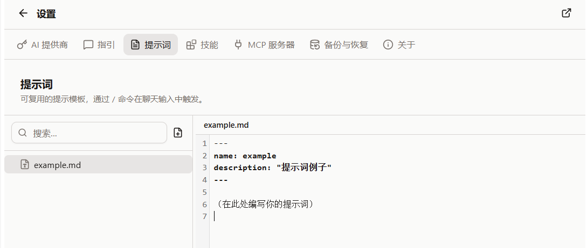

import Placeholder from '@/components/Placeholder.astro';
import QA from '@/components/docs/QA.astro';
import QAItem from '@/components/docs/QAItem.astro';

A Slash Prompt is a set of prompt templates you write yourself. While typing a message, just type `/` first and you can pick a template from the list to attach to the message you're about to send.

It's great for saving requests you write repeatedly, such as summarizing a web page, translating selected content, organizing meeting notes, or rewriting copy.


## Create a Prompt

The entry point is under "Settings → Prompts".



Click "New file" on the left and create a Markdown file ending in `.md`. Edits are saved automatically; Ctrl/Cmd+S saves immediately. A Prompt file looks roughly like this:

```md
---
name: summarize-page
description: Summarize the current page
---

Please read the current page content and summarize it in concise bullet points.
```

Where:

- `name` is the name shown in the slash menu
- `description` is a one-line note to help you tell them apart later
- the body below the frontmatter is the content that ultimately gets sent to the model

For everyday use, a few short templates are enough to start. Once you get comfortable, gradually organize them into your own prompt library.

> The slash menu uses the frontmatter `name` when present; otherwise it uses the file name without `.md`. Only `.md` files directly inside `~/.cebian/prompts/` are scanned, not files in subfolders.

## Use it in a chat

Back in the chat input box, type `/` at the start of the text to open the Prompt list.

Keep typing to filter by name or description, use the up/down arrow keys and Enter to select, or click an item. Esc closes the list. With no matching item, Enter sends the literal `/keyword` text instead of attaching a template.

Rather than pasting the body in, Cebian attaches a tinted `/name` marker at the start of the first line, so a long template doesn't bury the message you're actually writing. Type your own request to the right of it and send — or send with just the marker, and the Prompt itself becomes the request.

The marker is not text: you cannot select part of it and the caret cannot go inside it. Move the caret to the very start of your text and press Backspace to take it off in one go. Once it's gone, the message no longer carries the Prompt.

In the conversation, the sent message simply starts with `/name` followed by whatever you typed — plain text, like the rest of the message. The Prompt body itself is not shown in the bubble; it is what Cebian sends to the model.

## Template variables

You can write variables in a Prompt. Cebian resolves them **when you select the template**, not when you send it. Select the template again after switching pages, changing the selection, or updating the clipboard.

| Variable | Meaning |
| --- | --- |
| `{{selected_text}}` | The text selected on the current page |
| `{{page_url}}` | The current page URL |
| `{{page_title}}` | The current page title |
| `{{date}}` | The current date |
| `{{ui_language}}` | The browser UI language, expressed as an English name |
| `{{clipboard}}` | Clipboard content |

Selecting a template attempts to read the clipboard to prepare variables, even if the template does not reference it. Only a template using `{{clipboard}}` inserts that value into the content to be sent.

For example:

```md
---
name: translate-selection
description: Translate the selected content
---

Please translate the following content into Simplified Chinese:

{{selected_text}}
```

If a variable can't be resolved, it's replaced with an empty string; if the variable name is misspelled, it's left in the text as-is.

## File location

Prompt files are stored in the VFS under `~/.cebian/prompts/`.

You generally don't need to open this path manually; just edit them under "Settings → Prompts". When backing up, choose "Skills & Prompts" and these files will be backed up too.

## Q&A

<QA>
<QAItem q="I typed / but don't see a list. What now?">First create a Prompt under "Settings → Prompts".</QAItem>
<QAItem q="The Prompt doesn't send automatically after I select it?">That's normal. Cebian only attaches it to the message; you can add your own request first, then send manually.</QAItem>
<QAItem q="What if a page variable is empty?">The current page may not allow reading, or you haven't selected any text.</QAItem>
<QAItem q="My Prompt is too long to maintain. What now?">Split it into several shorter templates and add the specific requirements when you use them.</QAItem>
</QA>