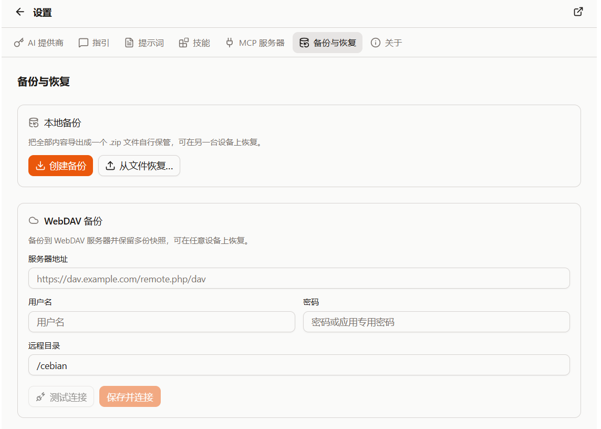

{/* AUTO-GENERATED from docs/zh by scripts/gen-zhtw.mjs — do not edit; edit zh then run `pnpm gen:zhtw`. */}

import Placeholder from '@/components/Placeholder.astro';
import QA from '@/components/docs/QA.astro';
import QAItem from '@/components/docs/QAItem.astro';

Cebian 的資料主要存在瀏覽器本地。換裝置、重灌瀏覽器，或者想在折騰配置前留一份保險時，可以先做一次備份。

備份入口在「設定 → 備份與恢復」。這裡有兩種方式：下載到本地，或者上傳到 WebDAV。

## 本地備份

本地備份會把資料匯出成一個 `.zip` 檔案，由你自己儲存。

具體操作如下：

1. 開啟「設定 → 備份與恢復」
2. 在「本地備份」裡點選「建立備份」
3. 選擇備份模式，必要時開啟「加密備份」
4. 確認後，瀏覽器會下載一個 `.zip` 檔案

如果只是臨時留一份保險，直接建立完整備份就行。

## WebDAV 備份

如果你希望多臺裝置之間都能恢復同一份備份，可以配置 WebDAV。

第一次使用時，需要填寫：

- 伺服器地址
- 使用者名稱
- 密碼或應用專用密碼
- 遠端目錄

填好後可以先點「測試連線」。連線正常後儲存，之後就可以點選「備份到 WebDAV」上傳快照。

WebDAV 頁面會列出伺服器上已有的快照。每份快照都可以恢復，也可以刪除。

## 備份模式

建立備份時有兩種模式：

- 完整備份：會話、設定、技能與提示詞，以及金鑰都會備份
- 部分備份：自己選擇要備份的內容

部分備份裡可以選擇：

- 會話記錄
- 一併備份工作區檔案
- 普通設定
- 技能與提示詞
- 金鑰資訊

普通使用的話，建議直接用完整備份；如果只是想遷移 Prompt 或 Skill，再用部分備份。

## 加密備份

如果備份裡包含「金鑰資訊」，強烈建議開啟加密。

金鑰資訊包括 API Key、OAuth token、WebDAV 密碼等。不開啟加密的話，這些內容會跟備份檔案放在一起，不適合分享給別人。

開啟加密後，需要輸入一個口令。恢復時也必須輸入同一個口令。

> 口令不會被 Cebian 儲存。請牢記口令，如果忘記口令，會導致無法恢復備份。

## 從備份恢復

本地備份和 WebDAV 快照都會進入同一個恢復流程。

恢復前，Cebian 會先顯示備份裡包含哪些內容。你可以選擇要恢復的分類，然後選擇恢復方式：

- 合併：只新增與更新，不會刪除本地資料
- 替換：先清空所選分類，再按備份原樣還原

不確定選哪個的話，先選「合併」。它更適合日常恢復，也不容易誤刪本地資料。

「替換」適合那種你明確想讓當前裝置變成備份裡的狀態的場景。比如剛裝好的新瀏覽器，或者本地配置已經亂了，想從備份重新來一次。

## 備份內容

不同分類對應的內容大致如下：

| 分類 | 內容 |
| --- | --- |
| 會話記錄 | 歷史對話、訊息、會話標題等 |
| 工作區檔案 | 對話中生成或儲存到 `/workspaces/` 的檔案 |
| 普通設定 | 主題、預設模型、自定義指引、MCP 的非金鑰配置等 |
| 技能與提示詞 | `~/.cebian/skills/` 和 `~/.cebian/prompts/` 裡的檔案 |
| 金鑰資訊 | Provider API Key、OAuth token、MCP token、WebDAV 憑據等 |

備份不會包含瀏覽器 Cookie 和網站登入態。所以恢復到新裝置後，有些模型訂閱或網站登入可能還需要重新授權。

## Q&A

<QA>
	<QAItem q="想遷移到新裝置，應該怎麼備份？">建立完整備份，建議開啟加密，然後在新裝置上從檔案或 WebDAV 恢復。</QAItem>
	<QAItem q="只想保留 Prompt / Skill 呢？">建立部分備份，只勾選「技能與提示詞」即可。</QAItem>
	<QAItem q="恢復時怕覆蓋本地資料怎麼辦？">選擇「合併」。它只新增與更新，不會刪除本地資料。</QAItem>
	<QAItem q="想完全按備份重來呢？">選擇「替換」，但確認前最好先再匯出一份當前資料。</QAItem>
	<QAItem q="WebDAV 連不上怎麼辦？">先檢查伺服器地址、使用者名稱、密碼和遠端目錄。有些服務需要應用專用密碼。</QAItem>
</QA>
