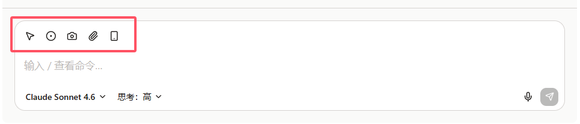

{/* AUTO-GENERATED from docs/zh by scripts/gen-zhtw.mjs — do not edit; edit zh then run `pnpm gen:zhtw`. */}

import Placeholder from '@/components/Placeholder.astro';
import LucideIcon from '@/components/docs/LucideIcon.astro';
import QA from '@/components/docs/QA.astro';
import QAItem from '@/components/docs/QAItem.astro';
import selectTool from '@/assets/demo/select-tool.mp4';
import recordReplay from '@/assets/demo/record-replay.mp4';

對話輸入框上方有一排小按鈕，用來把當前頁面、檔案、截圖或者操作過程一起交給 Cebian。

普通聊天不一定要用它們。只有當你想讓模型看得更具體一點時，再點對應的工具就行。

## <LucideIcon name="mouse-pointer-2" />選擇元素

如果你想問頁面裡的某個具體區域，可以點選「選擇元素」，然後在頁面上點一下目標元素。

比如：

- 解釋這個表格裡的欄位
- 看看這個按鈕為什麼樣式不對
- 提取這段程式碼或錯誤資訊
- 讓 Cebian 只關注頁面中的某個卡片

選中後，輸入框上方會出現一個元素標籤。你再補一句想做什麼，然後傳送即可。

<video controls preload="metadata" src={selectTool} aria-label="選擇一個元素並與之互動"></video>

> 瀏覽器設定頁、外掛市場、部分特殊頁面不允許擴充套件注入指令碼，這種頁面上元素選擇可能不可用。

## <LucideIcon name="circle-dot" />錄製操作

錄製適合那種「我做一遍，你看懂我剛才做了什麼」的場景。

點選錄製按鈕後，在頁面里正常操作；完成後再點一次停止，或者直接傳送下一條訊息。Cebian 會把這段操作作為附件一起發給模型。

比如：

- 錄一遍復現問題的步驟
- 錄一遍表單填寫流程，讓模型幫你整理規則
- 錄一遍重複操作，讓模型判斷哪些步驟可以自動化

<video controls preload="metadata" src={recordReplay} aria-label="錄製操作並重放"></video>

> 錄製的是操作過程，不是影片。它會記錄點選、輸入、頁面跳轉等事件，方便模型理解你剛才做了什麼。

## <LucideIcon name="camera" />截圖

如果頁面狀態比較重要，可以點選「截圖」，把當前標籤頁的可見區域一起發給模型。

它適合用來問一些視覺問題，比如：

- 這個頁面佈局哪裡不對
- 當前彈窗裡應該點哪個按鈕
- 這張圖表大概表達了什麼

截圖會作為圖片附件出現在輸入框上方。你可以繼續輸入問題，然後一起傳送。

> 截圖需要當前模型支援多模態輸入。如果按鈕不可用，可以先換一個支援圖片的模型。

## <LucideIcon name="paperclip" />上傳檔案

如果問題和本地檔案有關，可以點選「上傳檔案」。

目前主要適合上傳兩類檔案：

- 圖片：截圖、設計稿、報錯截圖等
- 文本檔案：Markdown、JSON、CSV、程式碼檔案、日誌檔案等

上傳後，檔案會作為附件跟隨下一條訊息傳送。普通文本檔案會直接交給模型閱讀；圖片同樣需要當前模型支援多模態輸入。

> 單條訊息最多可以帶 10 個附件。很大的檔案建議先擷取相關片段再上傳。

## <LucideIcon name="smartphone" />移動端模式

如果你想檢查當前頁面在手機視口下的表現，可以點選「移動端模式」。

開啟後，當前標籤頁會臨時模擬成手機螢幕。你可以一邊看頁面變化，一邊問 Cebian：

- 移動端佈局哪裡擠在一起了
- 這個按鈕在手機上是不是太小
- 首屏資訊有沒有被遮住

再點一次按鈕可以退出移動端模式。

> 這個模式隻影響當前標籤頁，用來快速看移動端狀態；如果頁面本身不支援響應式，它不會自動幫頁面變好。

## <LucideIcon name="mic" />語音輸入

如果不想打字，可以點選麥克風按鈕，把你說的話寫進輸入框。

第一次使用時，瀏覽器可能會要求麥克風許可權。授權後，Cebian 會把識別結果直接追加到輸入框裡，你可以繼續修改，再手動傳送。

語音輸入適合臨時記錄比較長的想法，比如：

- 口述一段要總結的要求
- 快速描述一個頁面問題
- 邊看頁面邊說出你想讓模型做什麼

> 語音識別在本地完成。不同瀏覽器和系統環境的可用性可能不一樣，如果按鈕沒有出現，就先用鍵盤輸入。

## 工具選擇

- 想問頁面某一塊：用「選擇元素」
- 想讓模型看當前畫面：用「截圖」
- 想讓模型讀本地內容：用「上傳檔案」
- 想說明一串操作步驟：用「錄製操作」
- 想檢查移動端頁面：開啟「移動端模式」
- 不想打字：用「語音輸入」

## Q&A

<QA>
	<QAItem q="截圖或圖片按鈕不可用怎麼辦？">當前模型不支援多模態輸入，換一個支援圖片的模型即可。</QAItem>
	<QAItem q="檔案傳不上去怎麼辦？">目前主要支援圖片和常見文本檔案，單條訊息最多 10 個附件。</QAItem>
	<QAItem q="特殊頁面選不了元素怎麼辦？">瀏覽器出於安全限制，不允許擴充套件讀取這些頁面。換一個普通網頁再試。</QAItem>
	<QAItem q="錄製按鈕點了沒反應怎麼辦？">可能另一個側邊欄正在錄製，先停掉那邊的錄製再試。</QAItem>
</QA>
