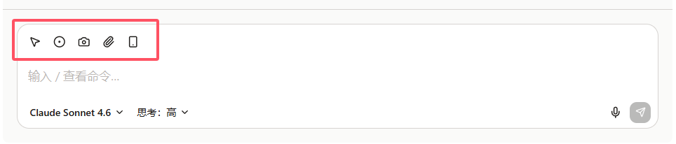

{/* AUTO-GENERATED from docs/zh by scripts/gen-zhtw.mjs — do not edit; edit zh then run `pnpm gen:zhtw`. */}

import { Image } from 'astro:assets';
import RecordingOptionsShot from '@/assets/docs/recording-options.png';
import FileAttachmentShot from '@/assets/docs/file-attachment.png';
import FileDropzoneShot from '@/assets/docs/file-dropzone.png';

import LucideIcon from '@/components/docs/LucideIcon.astro';
import QA from '@/components/docs/QA.astro';
import QAItem from '@/components/docs/QAItem.astro';
import selectTool from '@/assets/demo/select-tool.mp4';
import recordReplay from '@/assets/demo/record-replay.mp4';

對話輸入框上方有一排小按鈕，用來把當前頁面、檔案、截圖或者操作過程一起交給 Cebian。語音輸入的麥克風按鈕位於輸入框下方、傳送按鈕旁。

普通聊天不一定要用它們。只有當你想讓模型看得更具體一點時，再點對應的工具就行。

## <LucideIcon name="mouse-pointer-2" />選擇元素

如果你想問頁面裡的某個具體區域，可以點選「選擇元素」，然後在頁面上點一下目標元素。

比如：

- 解釋這個表格裡的欄位
- 看看這個按鈕為什麼樣式不對
- 提取這段程式碼或錯誤資訊
- 讓 Cebian 只關注頁面中的某個卡片

選中後，輸入框上方會出現一個元素標籤。你再補一句想做什麼，然後傳送即可。

<video controls preload="metadata" src={selectTool} aria-label="選擇一個元素並與之互動"></video>

> 瀏覽器設定頁、外掛市場、部分特殊頁面不允許擴充套件注入指令碼，這種頁面上元素選擇可能不可用。

## <LucideIcon name="circle-dot" />錄製操作

錄製適合那種「我做一遍，你看懂我剛才做了什麼」的場景。

點選錄製按鈕後，在頁面里正常操作；完成後再點一次停止，或者直接傳送下一條訊息。Cebian 會把這段操作作為附件一起發給模型。

比如：

- 錄一遍復現問題的步驟
- 錄一遍表單填寫流程，讓模型幫你整理規則
- 錄一遍重複操作，讓模型判斷哪些步驟可以自動化

<video controls preload="metadata" src={recordReplay} aria-label="錄製操作並重放"></video>

> 錄製的是操作過程，不是影片。它會記錄點選、輸入、頁面跳轉等事件，方便模型理解你剛才做了什麼。單次最多錄製 10 分鐘或 1,000 個操作事件；發給模型的錄製附件超過 256 KiB 時會縮減網路摘要，必要時截去末尾事件。

### 同時錄製網路請求

<Image src={RecordingOptionsShot} alt="錄製選項：頁面操作和網路請求" loading="lazy" />

錄製按鈕旁的小箭頭開啟「錄製選項」，可以勾選「頁面操作」和「網路請求」（選擇會被記住，網路請求預設關閉；兩項都不勾時無法開始錄製）。開啟網路請求後，頁面在你操作時發出的介面呼叫、頁面載入以及 WebSocket / EventSource 連線也會被記下來，和操作按時間排在同一條時間線上，模型能看出「點了這個按鈕之後調了哪個介面、返回了什麼」。

適合這些場景：

- 想讓模型學會用某個網站，寫成技能，或者直接呼叫它的介面取資料
- 復現 bug 時連同出錯的請求和響應一起交給模型
- 找頁面上某個資料是從哪個介面來的

幾點說明：

- 錄製期間 Chrome 視窗頂部會顯示除錯提示條，停止錄製後消失（移動端模式還開著時會保留）。點提示條上的「取消」會停止網路錄製（頁面操作照常錄），移動端模式開著的話也會一起關閉。
- 能識別出的令牌、密碼、API Key、認證頭等敏感值會替換成 `[redacted]`，Cookie / Set-Cookie 頭的值也會被打碼；沒有可識別名稱的敏感值（比如直接寫在 URL 路徑裡的令牌）可能保留，傳送或分享前請檢查。圖片、指令碼等靜態資源不錄，已識別的常見統計、監控服務的請求會被過濾，附件上會顯示過濾了多少個。
- 發給模型的是每個請求的摘要；完整記錄（請求頭、請求體、響應內容）在傳送時儲存成 HAR 檔案，放在這個對話工作目錄的 `recordings/` 下，模型需要細節時可以再讀取。已傳送訊息上的網路圖示可以開啟這個檔案，輸入框裡的附件上可以直接下載。
- 只保留能按規則脫敏的正文格式（如 JSON、表單），HTML、XML、無結構純文本等正文會省略。單個請求體或響應體超過 64 KiB 不記錄內容；一次網路錄製最多 500 個請求、正文與訊息預覽合計最多 5 MiB。
- Firefox 下開啟網路錄製需要 `webRequest` 許可權；會記錄請求資訊（含可獲取的請求體）、響應狀態和響應頭，但不記錄響應體或 WebSocket / EventSource 訊息內容。若拒絕許可權，只錄制已勾選的頁面操作；如果只勾了網路請求，則不會開始錄製。

## <LucideIcon name="camera" />截圖

如果頁面狀態比較重要，可以點選「截圖」，把當前標籤頁的可見區域一起發給模型。

它適合用來問一些視覺問題，比如：

- 這個頁面佈局哪裡不對
- 當前彈窗裡應該點哪個按鈕
- 這張圖表大概表達了什麼

截圖會作為圖片附件出現在輸入框上方。你可以繼續輸入問題，然後一起傳送。

> 截圖需要當前模型支援多模態輸入。如果按鈕不可用，可以先換一個支援圖片的模型。

## <LucideIcon name="paperclip" />上傳檔案

如果問題和本地檔案有關，可以點選「上傳檔案」。

支援以下兩類檔案：

| 型別 | 支援範圍 | 單個檔案上限 |
| --- | --- | --- |
| 圖片 | PNG、JPEG、GIF、WebP、SVG | 5 MiB |
| 文本 | 常見文件、資料、程式碼與配置檔案 | 100 KiB |

文本檔案按副檔名識別，包括 TXT、Markdown、CSV、JSON 等文件與資料，以及常見程式碼和配置檔案（如 JavaScript、Python、HTML、CSS、YAML）。

這裡不支援直接附加 PDF、Word、Excel 或壓縮包。要閱讀 PDF，可先在瀏覽器標籤頁開啟它，再讓 Cebian 使用 PDF 工具讀取；本地 `file://` PDF 還可能需要開啟擴充套件的檔案網址訪問許可權。

上傳後，檔案會作為附件跟隨下一條訊息傳送。普通文本檔案會直接交給模型閱讀；圖片同樣需要當前模型支援多模態輸入。

> 單條訊息最多 10 個附件，檔案、截圖、選中元素和操作錄製共用這個額度。超出大小上限的檔案不會加入；可以先裁剪圖片或擷取相關文本。

上傳後，檔案會顯示為附件標籤，傳送前可以檢查。

<Image src={FileAttachmentShot} alt="輸入框上方的演示檔案附件" loading="lazy" />

也可以把檔案拖到聊天訊息區或輸入框，看到「鬆開以新增附件」後鬆開；不支援拖入資料夾。支援圖片的模型還可以直接接收貼上到輸入框的圖片；上傳、拖放和貼上共用上述型別與大小限制。

<Image src={FileDropzoneShot} alt="拖入檔案時的聊天區域高亮與鬆開以新增附件提示" loading="lazy" />

## <LucideIcon name="smartphone" />移動端模式

如果你想檢查當前頁面在手機視口下的表現，可以點選「移動端模式」。

開啟後，當前標籤頁會臨時模擬成手機螢幕。你可以一邊看頁面變化，一邊問 Cebian：

- 移動端佈局哪裡擠在一起了
- 這個按鈕在手機上是不是太小
- 首屏資訊有沒有被遮住

再點一次按鈕可以退出移動端模式。

> 移動端模式依賴 Chromium 的偵錯程式介面，Firefox 不顯示此按鈕。它只改變當前標籤頁的視口和 User-Agent，不是真正的手機或 Safari 環境；如果頁面本身不支援響應式，它不會自動幫頁面變好。

## <LucideIcon name="mic" />語音輸入

如果不想打字，可以點選麥克風按鈕，把你說的話寫進輸入框。

首次使用可能會開啟獨立的麥克風授權頁。在該頁允許訪問後，回到側邊欄再點一次麥克風即可開始；如果之前拒絕過許可權，按提示到瀏覽器的麥克風設定裡重新允許。

識別結果會即時寫入輸入框，你可以繼續修改；再點麥克風停止聽寫，檢查文字後手動傳送。

語音輸入適合臨時記錄比較長的想法，比如：

- 口述一段要總結的要求
- 快速描述一個頁面問題
- 邊看頁面邊說出你想讓模型做什麼

### 識別方式與語言

- **本地優先、雲端回退**：本地引擎和對應語言可用時在裝置上識別；不支援本地識別、該語言不可用或語言包下載失敗時，自動改用瀏覽器提供的雲端識別。雲端路徑可能把音訊傳送給瀏覽器的語音服務，並需要網路連線，不等同於你配置的聊天模型。
- **語言包**：本地語言包可下載但尚未就緒時，按鈕顯示準備狀態並暫時不可點選；下載完成後自動開始聽寫，無需再點一次。
- **語言選擇**：跟隨瀏覽器介面語言。簡體中文使用普通話簡體語言包，臺灣、香港或繁體中文使用普通話繁體語言包，其他介面語言使用美式英語；沒有獨立的語音語言選擇器。

> 是否顯示麥克風按鈕取決於瀏覽器是否提供語音識別 API；Firefox 等不提供該 API 的環境會隱藏按鈕。當前介面沒有強制「僅本地」的開關。若不接受雲端回退，請使用鍵盤輸入。

## 工具選擇

- 想問頁面某一塊：用「選擇元素」
- 想讓模型看當前畫面：用「截圖」
- 想讓模型讀本地內容：用「上傳檔案」
- 想說明一串操作步驟：用「錄製操作」
- 想檢查移動端頁面：開啟「移動端模式」
- 不想打字：用「語音輸入」

## Q&A

<QA>
	<QAItem q="截圖或圖片按鈕不可用怎麼辦？">當前模型不支援多模態輸入，換一個支援圖片的模型即可。</QAItem>
	<QAItem q="檔案傳不上去怎麼辦？">檢查檔案型別和大小：圖片不超過 5 MiB，支援的文本檔案不超過 100 KiB，所有附件合計最多 10 個；圖片還需要支援圖片輸入的模型。</QAItem>
	<QAItem q="特殊頁面選不了元素怎麼辦？">瀏覽器出於安全限制，不允許擴充套件讀取這些頁面。換一個普通網頁再試。</QAItem>
	<QAItem q="錄製按鈕點了沒反應怎麼辦？">可能另一個側邊欄正在錄製，先停掉那邊的錄製再試。</QAItem>
	<QAItem q="附件上顯示「網路錄製已中止」是怎麼回事？">錄製期間點了瀏覽器提示條上的「取消」（Firefox 下則是撤銷了許可權），之後的請求沒有錄到，之前錄到的仍會發給模型。</QAItem>
	<QAItem q="附件上顯示「未能錄製網路」怎麼辦？">通常是另一個擴充套件或除錯工具已經在除錯這個標籤頁，或者在 Firefox 下沒有授予許可權。關掉佔用的工具（或授予許可權）後重新錄製即可。</QAItem>
</QA>
