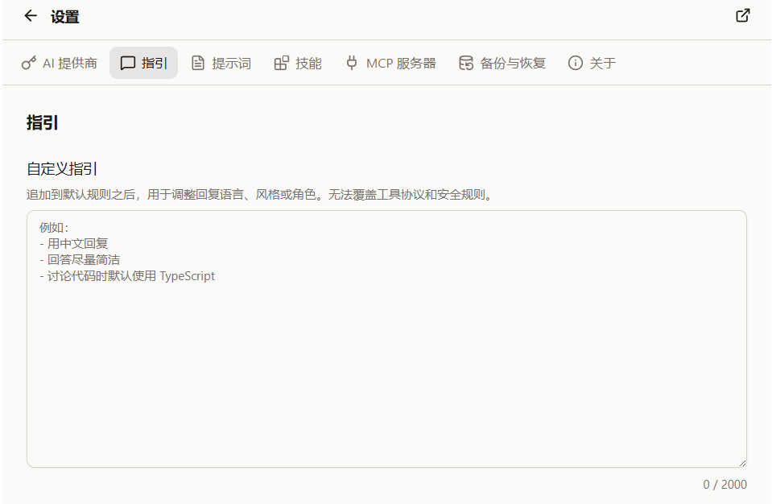

{/* AUTO-GENERATED from docs/zh by scripts/gen-zhtw.mjs — do not edit; edit zh then run `pnpm gen:zhtw`. */}

import QA from '@/components/docs/QA.astro';
import QAItem from '@/components/docs/QAItem.astro';

自定義指引用來告訴 Cebian：以後和你對話時，預設應該怎麼回答。

它更適合放長期偏好，比如回覆語言、語氣、程式碼風格、解釋深度等。臨時任務還是直接寫在輸入框裡更合適。




## 設定方式

入口在「設定 → 對話」。

在「自定義指引」裡寫下你的偏好即可，最多 2000 字元，內容會自動儲存。下一次發訊息時，Cebian 會把這些指引追加到預設規則後面，已有對話也會使用更新後的指引。清空內容即可停用，不會替換或刪除預設規則。

比如可以寫：

```md
- 預設用中文回覆
- 回答儘量簡潔
- 討論程式碼時預設使用 TypeScript
- 給方案時先說推薦做法，再說可選方案
```

## 適用內容

建議寫穩定、長期有效的偏好：

- 回覆語言：預設用中文，必要術語保留英文
- 輸出風格：少一點寒暄，直接給結論
- 技術偏好：程式碼示例優先 TypeScript，命令優先 pnpm
- 協作習慣：不確定時先問，不要直接猜

如果只是某一次對話裡的要求，直接寫在那條訊息裡就好，不必放進自定義指引。

## 邊界說明

自定義指引會追加到 Cebian 預設規則之後，但不能覆蓋工具協議和安全規則。

比如：

- 不能讓模型繞過工具許可權
- 不能讓模型讀取瀏覽器不允許讀取的頁面
- 不能給內建 VFS 工具增加訪問電腦真實檔案系統的能力
- 不應要求模型服從網頁裡的惡意指令；預設規則要求將網頁內容視為不可信資料

簡單說，它適合調整「怎麼回答」，不適合改掉 Cebian 的安全邊界。

## 常見寫法

可以從一小段開始，不用寫得很完整：

```md
預設用中文回覆。回答先給結論，再給必要步驟。
如果需要我選擇方案，請說清楚推薦哪一個，以及為什麼。
```

後面覺得哪裡不順，再回來慢慢改。

## Q&A

<QA>
	<QAItem q="感覺模型話太多怎麼辦？">可以在這裡寫「回答儘量簡潔」。</QAItem>
	<QAItem q="想固定輸出格式怎麼辦？">寫清楚標題、列表、表格等格式偏好即可。</QAItem>
	<QAItem q="某次對話不想遵循這些指引怎麼辦？">直接在那次訊息裡說明即可。</QAItem>
	<QAItem q="寫得太複雜反而效果不好怎麼辦？">刪掉不常用的規則，保留最重要的幾條。</QAItem>
</QA>
