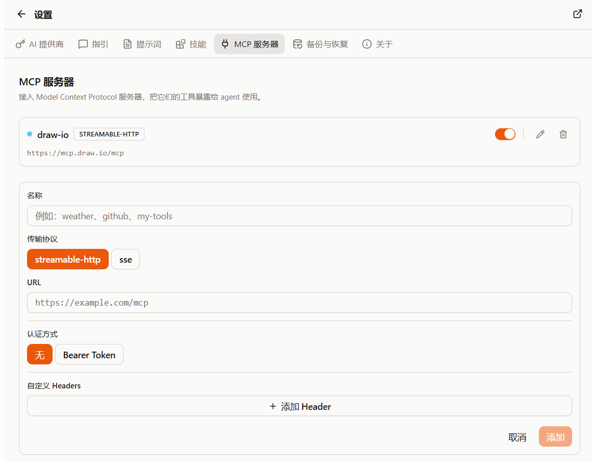

{/* AUTO-GENERATED from docs/zh by scripts/gen-zhtw.mjs — do not edit; edit zh then run `pnpm gen:zhtw`. */}

import Placeholder from '@/components/Placeholder.astro';
import QA from '@/components/docs/QA.astro';
import QAItem from '@/components/docs/QAItem.astro';
import StatusLegend from '@/components/docs/StatusLegend.astro';

MCP 用來把外部工具接進 Cebian。配置好 MCP 伺服器後，伺服器提供的工具會出現在 Agent 的工具列表裡，模型可以在對話中按需呼叫。

它適合接資料庫、內部系統、檔案服務、業務 API，或者任何已經封裝成 MCP server 的工具。



## 新增 MCP 伺服器

入口在「設定 → MCP 伺服器」。

點選「新增 MCP 伺服器」後，需要填寫：

- 名稱：方便你在列表裡區分，比如 `github`、`weather`、`my-tools`
- 傳輸協議：`streamable-http` 或 `sse`
- URL：MCP server 的 HTTP 地址
- 認證方式：無，或者 Bearer Token
- 自定義 Headers：需要額外請求頭時再填

儲存後，Cebian 會在後臺連線伺服器並讀取它提供的工具。

## 傳輸協議選擇

如果你的 MCP server 支援 `streamable-http`，優先選擇它。

`sse` 主要用於相容一些舊服務。兩者都需要是 HTTP 或 HTTPS 地址，不能填寫本地檔案路徑或其它協議。

## 對話中使用

配置並啟用伺服器後，你不需要手動複製工具名。

當你的問題需要外部工具時，Agent 會自己判斷是否呼叫 MCP 工具。比如你接入了一個查詢天氣的 server，就可以直接問：

```md
幫我查一下明天上海的天氣。
```

如果 server 提供了帶介面的 MCP App，工具結果裡還可能出現一個內嵌互動檢視。這個檢視由對應 server 提供，Cebian 負責把它顯示在對話裡。

## 狀態標識

每個 MCP server 左側會有一個小圓點，用不同顏色標識當前狀態：

<StatusLegend
	items={[
		{ color: 'blue', label: '等待首次呼叫', text: '已經儲存，但還沒真正用過' },
		{ color: 'green', label: '已連線', text: '當前連線正常' },
		{ color: 'sky', label: '未連線', text: '下一次呼叫時會重新連線' },
		{ color: 'yellow', label: '重連中', text: '正在嘗試恢復連線' },
		{ color: 'red', label: '暫時不可用', text: '連續失敗後會短暫熔斷，稍後再試' },
		{ color: 'gray', label: '已停用', text: '這個 server 不會出現在 Agent 的工具列表裡' },
	]}
/>

如果某個服務暫時用不上，可以先把它停用，不需要刪除配置。

## 認證與 Headers

如果伺服器需要 Bearer Token，就在「認證方式」裡選擇 Bearer Token 並填入 token。

如果伺服器需要其它請求頭，可以在「自定義 Headers」裡新增。注意：使用 Bearer Token 時，不要再手動新增 `Authorization` header，Cebian 會自動處理。

## Q&A

<QA>
	<QAItem q="工具沒有被呼叫怎麼辦？">先確認 server 已啟用，並且你的問題確實需要這個工具。</QAItem>
	<QAItem q="狀態一直不可用怎麼辦？">檢查 URL、網路、token 和 server 日誌。</QAItem>
	<QAItem q="新增時報 URL 無效怎麼辦？">URL 必須以 <code>http://</code> 或 <code>https://</code> 開頭。</QAItem>
	<QAItem q="不確定協議選哪個？">優先試 <code>streamable-http</code>。</QAItem>
	<QAItem q="擔心配置丟失怎麼辦？">備份時選擇「普通設定」和「金鑰資訊」，MCP 配置和 token 會一起備份。</QAItem>
</QA>
