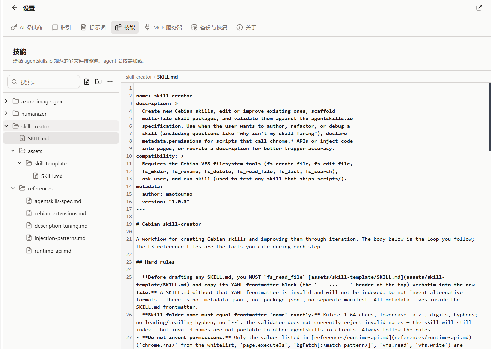

{/* AUTO-GENERATED from docs/zh by scripts/gen-zhtw.mjs — do not edit; edit zh then run `pnpm gen:zhtw`. */}

import Placeholder from '@/components/Placeholder.astro';
import QA from '@/components/docs/QA.astro';
import QAItem from '@/components/docs/QAItem.astro';

Skill 是一份給 Agent 使用的操作手冊。它可以把某類任務的背景知識、固定步驟、注意事項和指令碼放在一起，讓模型在需要時自己讀取。

如果 Slash Prompt 更像「一段可複用的輸入」，那 Skill 更像「一套可複用的工作流」。



## 適用場景

當一件事需要反覆做，而且每次都有一套固定規則時，就適合做成 Skill。

比如：

- 固定格式的調研報告
- 某個網站的價格對比流程
- 公司內部系統的操作規範
- 一組需要配合使用的指令碼和參考資料

如果只是想快速插入一段提示詞，用 Slash Prompt 就夠了；如果需要多個檔案、指令碼或詳細說明，再考慮 Skill。

## Skill Creator skill

如果你還沒有寫過 Skill，可以先從官方的 Skill Creator skill 開始。

它本身也是一個 Skill，作用是幫你把想法整理成符合 Cebian 結構的 Skill 草稿。你可以直接在對話裡描述想做什麼，比如「幫我做一個用於調研競品價格的 Skill」，它會幫你生成目錄、`SKILL.md` 和必要的說明。

普通使用的話，可以先讓它生成一個能跑起來的版本，再回到技能編輯器裡慢慢調整細節。

它會隨 Cebian 的 Github Release 一起釋出，檔名是 `skill-creator.zip`：

[Cebian Github Releases](https://github.com/maotoumao/Cebian/releases)

安裝方式：

1. 下載 `skill-creator.zip`
2. 開啟「設定 → 技能」
3. 點選「匯入…」
4. 選擇剛才下載的 zip

匯入後，你就可以在對話裡讓 Cebian 幫你建立或修改 Skill。

## 建立 Skill

入口在「設定 → 技能」。

點選「建立技能」後，Cebian 會自動生成一個 `new-skill` 資料夾，裡面包含：

- `SKILL.md`：技能入口檔案，寫說明和觸發條件
- `scripts/`：可選，用來放指令碼
- `references/`：可選，用來放參考資料

一個最小的 `SKILL.md` 大致長這樣：

```md
---
name: price-compare
description: 對多個商品頁面做價格對比，並整理成表格。
---

## Instructions

當用戶要求比較價格時，先讀取當前頁面，再整理商品名、價格、連結和備註。
```

`description` 很重要。Agent 會先看技能索引，判斷當前請求是否適合讀取這個 Skill。

## 觸發機制

你不需要手動在對話裡點某個 Skill。

當用戶請求和某個 Skill 的名字或描述匹配時，Agent 會先讀取它的 `SKILL.md`，再按裡面的說明繼續工作。

如果 Skill 裡提到還需要讀取 `references/` 或執行 `scripts/`，Agent 也會按需使用這些檔案。

## 匯入與匯出

技能頁面支援匯入和匯出。

- 「匯入」：選擇一個 `.zip` 技能包，確認後寫入 VFS
- 「匯出」：匯出當前選中的 Skill
- 「匯出全部」：把所有 Skill 打包成一個備份 zip

匯入時如果同名 Skill 已存在，可以選擇覆蓋，也可以保留兩份。

> 覆蓋已有 Skill 時，之前授予過的「始終允許」許可權會被清掉。新的指令碼如果要執行，需要重新確認。

## 許可權與指令碼

Skill 可以包含指令碼，也可以宣告需要的許可權。

當指令碼要執行一些敏感操作時，Cebian 會在對話裡彈出授權卡片。你可以選擇：

- 拒絕
- 僅本次允許
- 始終允許此技能

普通 Skill 只寫說明和參考資料也可以，不一定要寫指令碼。剛開始建議先從純說明型 Skill 寫起。

## 檔案位置

Skill 儲存在 VFS 的 `~/.cebian/skills/` 目錄下。

你一般不需要手動開啟這個路徑，直接在「設定 → 技能」裡管理即可。備份時選擇「技能與提示詞」，Skill 檔案也會一起備份。

## Q&A

<QA>
	<QAItem q="Skill 沒有被觸發怎麼辦？">檢查 <code>name</code> 和 <code>description</code> 是否說清楚了適用場景。Agent 主要靠它們判斷要不要讀取這個 Skill。</QAItem>
	<QAItem q="Skill 寫得太長怎麼辦？">把穩定規則放在 <code>SKILL.md</code>，大段參考資料放到 <code>references/</code>。</QAItem>
	<QAItem q="不確定要不要寫指令碼怎麼辦？">先不寫。等確實需要自動執行時，再加 <code>scripts/</code>。</QAItem>
	<QAItem q="匯入別人的 Skill 要注意什麼？">先看一下 <code>SKILL.md</code> 和 <code>scripts/</code>，確認來源可信再使用。</QAItem>
</QA>
