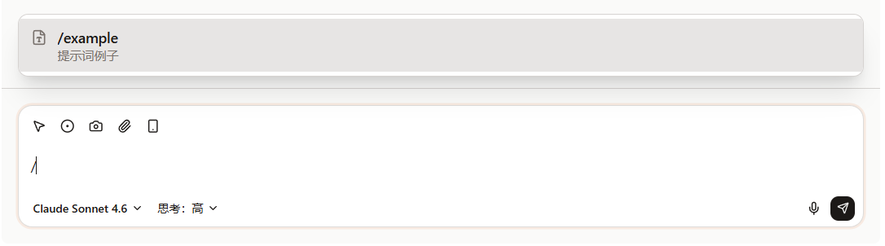

{/* AUTO-GENERATED from docs/zh by scripts/gen-zhtw.mjs — do not edit; edit zh then run `pnpm gen:zhtw`. */}

import Placeholder from '@/components/Placeholder.astro';
import QA from '@/components/docs/QA.astro';
import QAItem from '@/components/docs/QAItem.astro';

Slash Prompt 是一組你自己寫的提示詞模板。平時輸入訊息時，只要先輸入 `/`，就可以從列表裡選一個模板掛到這條訊息上。

它適合儲存那些你經常重複寫的要求，比如總結網頁、翻譯選中內容、整理會議記錄、改寫文案等。



## 建立 Prompt

入口在「設定 → 提示詞」。


點選左側的「新建檔案」，建立一個以 `.md` 結尾的 Markdown 檔案。編輯內容會自動儲存，也可以按 Ctrl/Cmd+S 立即儲存。一個 Prompt 檔案大致長這樣：

```md
---
name: summarize-page
description: 總結當前頁面
---

請閱讀當前頁面內容，用簡潔的要點總結它。
```

其中：

- `name` 是斜槓選單裡顯示的名字
- `description` 是一行說明，方便你之後區分
- frontmatter 下面的正文，就是最終會發給模型的內容

普通使用的話，先寫幾個短模板就夠了。等用順手了，再慢慢整理成自己的提示詞庫。

> 斜槓選單優先顯示 frontmatter 裡的 `name`；未填寫該欄位時，使用去掉 `.md` 的檔名。只會掃描 `~/.cebian/prompts/` 下直接存放的 `.md` 檔案，不會遞迴讀取子目錄。

## 在對話裡使用

回到對話輸入框，在文字開頭輸入 `/` 就會開啟 Prompt 列表。

你可以繼續輸入關鍵詞按名稱或描述篩選，用上下方向鍵選中後按回車，或者直接點選某一項。按 Esc 可關閉列表；沒有匹配項時，回車會直接傳送輸入的 `/關鍵詞`，不會自動呼叫模板。

Cebian 不會把正文粘進輸入框，而是在輸入框首行左端掛一枚帶色的 `/名字` 標記——再長的模板也不會把你正要寫的話淹掉。你可以在它右邊接著寫自己的要求再發送；也可以只掛著標記直接發，此時 Prompt 本身就是這一輪的請求。

標記不是文字：你選不中它的一部分，游標也進不去。把游標移到文字最前面按一下退格，就能整個摘掉。摘掉之後，這條訊息就不再攜帶這個 Prompt。

傳送後，對話裡的這條訊息就是以 `/名字` 開頭、後面接你自己打的話，和普通文字一個樣式。Prompt 正文不會在氣泡裡展開——它是 Cebian 實際發給模型的內容。

## 模板變數

Prompt 裡可以寫一些變數。Cebian 在**選中模板時**取值並替換，不會在傳送時重新取值。切換頁面、改變選區或更新剪貼簿後，請重新選擇模板。

| 變數 | 含義 |
| --- | --- |
| `{{selected_text}}` | 當前頁面選中的文字 |
| `{{page_url}}` | 當前頁面 URL |
| `{{page_title}}` | 當前頁面標題 |
| `{{date}}` | 當前日期 |
| `{{ui_language}}` | 瀏覽器介面語言的英文名稱 |
| `{{clipboard}}` | 剪貼簿內容 |

選擇模板時會嘗試讀取剪貼簿來準備變數，即使模板沒有引用它；只有使用 `{{clipboard}}` 的模板才會把該值填入要傳送的內容。

比如：

```md
---
name: translate-selection
description: 翻譯選中的內容
---

請把下面這段內容翻譯成簡體中文：

{{selected_text}}
```

如果某個變數取不到內容，會被替換成空字串；如果變數名寫錯了，會原樣留在文本里。

## 檔案位置

Prompt 檔案儲存在 VFS 裡的 `~/.cebian/prompts/`。

你一般不用手動開啟這個路徑，直接在「設定 → 提示詞」裡編輯就行。備份時選擇「技能與提示詞」，這些檔案也會一起備份。

## Q&A

<QA>
	<QAItem q="輸入 / 沒有看到列表怎麼辦？">先去「設定 → 提示詞」建立一個 Prompt。</QAItem>
	<QAItem q="選中 Prompt 後沒有自動傳送？">這是正常的。Cebian 只會把它掛到訊息上，你可以先補上自己的要求，再手動傳送。</QAItem>
	<QAItem q="頁面變數為空怎麼辦？">當前頁面可能不允許讀取，或者你沒有選中文字。</QAItem>
	<QAItem q="Prompt 太長不好維護怎麼辦？">可以拆成幾個更短的模板，用的時候再補充具體要求。</QAItem>
</QA>
