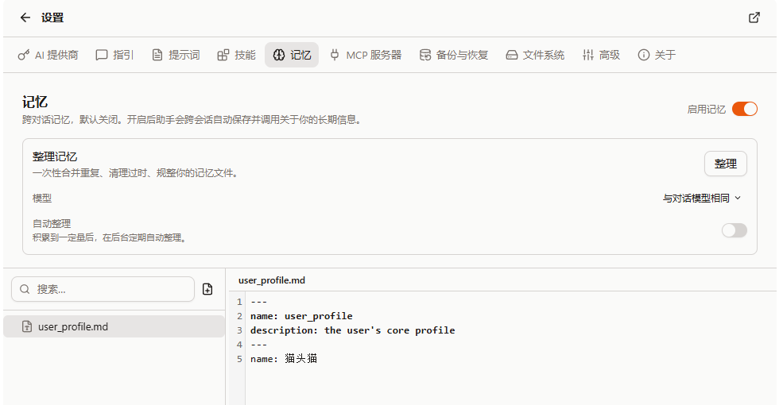

import QA from '@/components/docs/QA.astro';
import QAItem from '@/components/docs/QAItem.astro';

Cebian 默认每次新对话都是从零开始的——它不会记得你上次说过什么。记忆功能让 AI 在对话里自己把「关于你的、以后还用得上的」信息沉淀成本地文件，下次新对话自动带上相关的部分。

这个功能默认关闭，需要你在设置里手动开启。

## 开启记忆

入口在「设置 → 记忆」。打开顶部的「开启记忆」后，对话会带上记忆指引、核心档案和索引。关闭后停止自动注入与自动整理，但不会删除文件，也不是文件工具的访问禁令；你仍能在设置页管理已有记忆。

## 记忆怎么存

每条记忆是 `~/.cebian/memories/` 下的一个 Markdown 文件（在 VFS 里，不是你电脑上的真实目录）。AI 写记忆用的就是普通的文件工具，所以你在对话里能看到它「记忆中…」的动作。

开启记忆时，每轮对话都会带上一份精简索引——包含标题、类型、描述、距上次修改的时间和文件路径；AI 需要细节时再读对应文件。索引有大小上限，过多时会截断，不会一次注入所有正文。

其中有一个特殊的文件 `user_profile.md`，存的是你的核心档案（名字、职业、语言、无障碍特征等）。正文在大小上限内时每轮完整注入；过长时改为描述摘要和读文件提示，所以应保持简短。

## 会记什么、不会记什么

会记的，是那些「跨对话、以后还用得上」的信息，比如：

- 你是谁、做什么、习惯用什么语言
- 长期偏好（比如「回答先给结论」「代码别加多余注释」）
- 常用资源在哪（比如你的任务都放在某个 Notion）

提示词要求 AI 不保存以下内容（不是自动敏感信息过滤器）：

- 密码、token、cookie、支付与表单信息等敏感内容
- 一次性的任务状态、当前对话的临时上下文
- 能直接从页面读到、或随时能重新抓取的网页内容

即使你直接说「记住这个」，AI 也会先判断其中哪部分真的值得长期保留。

## 记忆的类型

每条记忆带一个类型，方便归类：

- user：关于你本人的核心信息（收敛进 `user_profile.md`）
- feedback：你对 AI 某次做法的纠正或确认
- context：你正在进行的事情的背景
- reference：常用资源、外部信息在哪

## 查看与管理

在「设置 → 记忆」里查看、编辑或删除记忆文件。删除后，后续自动注入不再包含该文件；已经进入旧对话消息、模型服务或备份的内容不会随之撤回。

## 整理记忆

记忆攒多了会出现重复、过时、零散。整理就是让一个临时的后台 AI 把记忆通读一遍，合并重复、清理过时、规整正文。

- 手动：在记忆页点「整理」按钮，立刻跑一次。
- 自动：打开「自动整理」后，后台定期检查；距上次成功整理够久（默认 14 天）、新增或改动的记忆够多（默认 30 条）、并且没有正在运行的对话时才执行。失败或冲突后的自动重试也会退避。

整理模型可以单独指定，未指定时使用最近选择的对话模型；指定模型不可用或关闭了工具调用时，也会尝试回退。整理需要能调用文件工具的模型，并会消耗该模型的额度。自动整理的间隔和改动条数可调整；首次整理没有上次成功时间，不需先等满 14 天。

整理 AI 只能操作临时副本。提交前会检查文件格式和原记忆是否发生变化；检查失败或发现冲突就丢弃本次结果。它不能保证 AI 不误删事实，最终文件替换也不是原子操作：整理期间避免同时编辑记忆，重要内容先备份。

## 备份

记忆可以单独纳入备份。在「设置 → 数据」创建备份时，把「记忆」勾上即可；恢复时也能单独选择是否还原记忆。想在换设备后保留记忆，记得在完整备份或部分备份里带上它。

## 隐私

- 本地保存不等于只在本地处理：核心档案和索引随对话发送给所选模型，按需读取的正文也会进入模型上下文；整理时，整理模型会读取记忆内容。使用远程模型就涉及向对应服务传输。
- 选择 WebDAV 备份并包含记忆时，记忆文件还会上传到你配置的服务器。
- 记忆可在设置页检查、修改和删除。不要将密码、token 等敏感信息当作记忆保存。
- 提示词要求排除敏感信息和网页指令，并把记忆视为低优先级上下文。这是行为约束，不是绝对的防泄漏或防提示注入保证。

## Q&A

<QA>
	<QAItem q="开启后 AI 会马上记住所有东西吗？">不会。它只在判断某条信息「跨对话、以后还用得上」时才记，而且尽量克制。</QAItem>
	<QAItem q="记忆存在哪？会上传吗？">文件存在浏览器本地 VFS；用于对话或整理的内容会发送给所选模型，包含记忆的 WebDAV 备份也会上传。</QAItem>
	<QAItem q="怎么删掉某条记忆？">在「设置 → 记忆」里找到对应文件删除即可，新对话就不会再带上它。</QAItem>
	<QAItem q="自动整理会不会乱删我的记忆？">副本、格式校验和冲突检测能降低风险，但不能判断每条事实是否被正确保留。重要记忆先备份，整理后检查结果。</QAItem>
	<QAItem q="换设备怎么保留记忆？">在备份里勾上「记忆」，到新设备恢复时选择还原记忆。</QAItem>
</QA>
